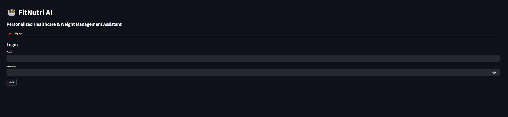
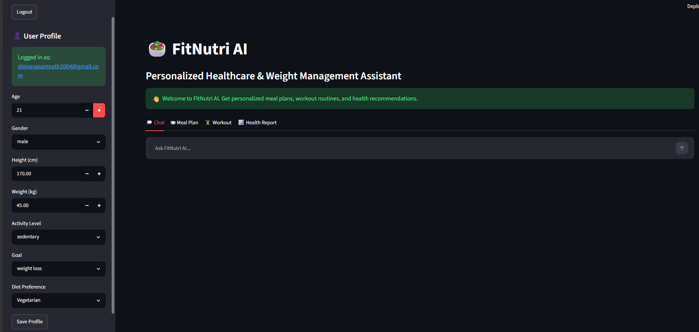
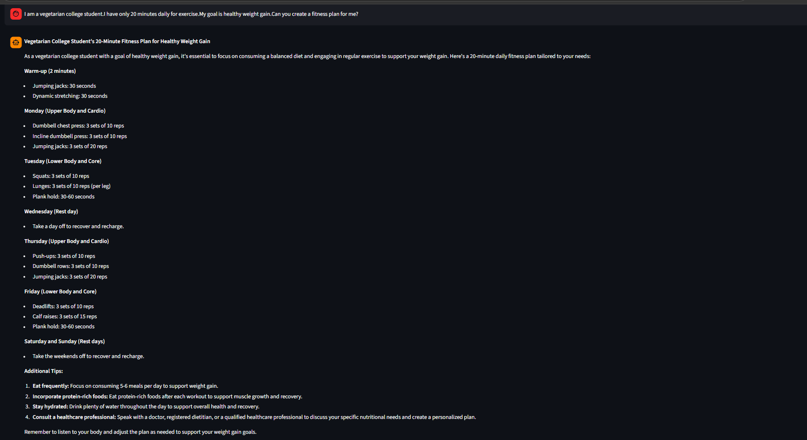
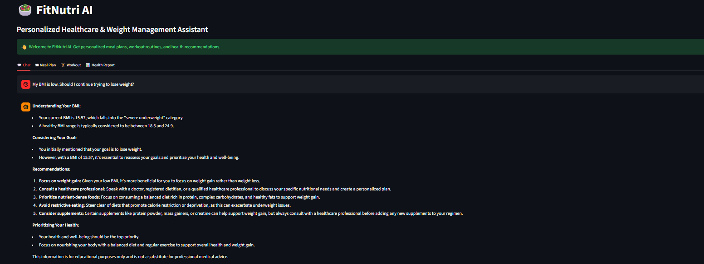
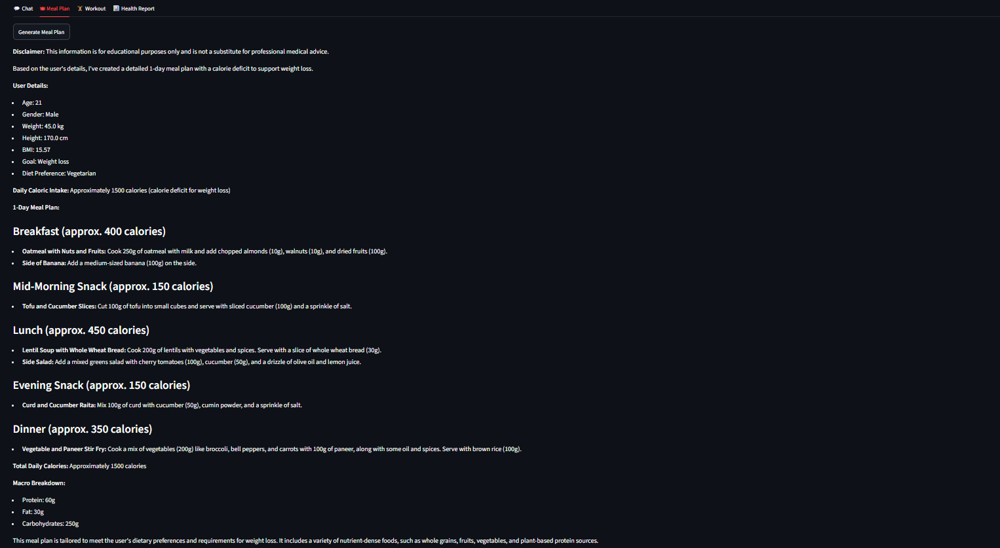
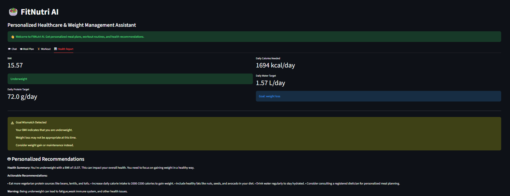

# 🥗 FitNutri AI

Personalized Healthcare & Weight Management Assistant powered by FastAPI, Streamlit, SQLite, and Groq LLM.

---

## 📌 Project Overview

FitNutri AI is an AI-powered health and nutrition assistant that helps users manage their fitness journey through personalized recommendations, meal plans, workout plans, calorie calculations, and health reports.

The application combines traditional health calculations with Generative AI to provide customized guidance based on each user's profile.

---

## 🚀 Features

### 👤 User Authentication

- User Signup
- User Login
- Secure Password Hashing
- SQLite-based User Management

### 📋 Profile Management

Users can save:

- Age
- Gender
- Height
- Weight
- Activity Level
- Goal
- Diet Preference

Profile data is stored permanently in SQLite.

---

### 🤖 AI Chatbot

Powered by Groq LLM.

Capabilities:

- Fitness Guidance
- Nutrition Advice
- Weight Management Support
- Personalized Responses
- Profile-Aware Recommendations
- Conversation History Support

---

### 🍽 AI Meal Plan Generator

Generates personalized meal plans based on:

- Age
- Weight
- BMI
- Goal
- Diet Preference

Supports:

- Vegetarian
- Vegan
- Eggetarian
- Non-Vegetarian

---

### 🏋 AI Workout Plan Generator

Creates:

- Home Workout Plans
- Beginner Friendly Routines
- Weekly Exercise Plans
- Goal-Based Workouts

Supports:

- Weight Loss
- Weight Gain
- Muscle Gain
- Maintenance

---

### 📊 Health Report Generator

Provides:

- BMI Analysis
- BMR Calculation
- Daily Calorie Requirement
- Daily Protein Requirement
- Daily Water Intake
- Personalized Recommendations

---

### ⚠ Goal Mismatch Detection

Example:

If a user is underweight but selects "Weight Loss" as their goal, the system automatically displays a warning and suggests healthier alternatives.

---

### 💾 Persistent Storage

SQLite is used to store:

- User Accounts
- Profiles
- Chat History

Data remains available even after restarting the application.

---

## 🛠 Tech Stack

### Frontend

- Streamlit

### Backend

- FastAPI

### Database

- SQLite

### AI Model

- Groq LLM
- Llama 3

### Language

- Python

---

## 📂 Project Structure

```text
fitnutri-ai/
│
├── app.py
├── streamlit_app.py
├── chatbot.py
├── calculations.py
├── database.py
├── models.py
├── requirements.txt
├── README.md
├── .gitignore
└── .env
```

---

## ⚙ Installation

### Clone Repository

```bash
git clone https://github.com/abinayasangeetha/FitNutri-AI.git
cd fitnutri-ai
```

### Create Virtual Environment

```bash
python -m venv venv
```

### Activate Environment

Windows:

```bash
venv\Scripts\activate
```

### Install Dependencies

```bash
pip install -r requirements.txt
```

---

## 🔑 Environment Variables

Create a `.env` file:

```env
GROQ_API_KEY=your_groq_api_key
```

---

## ▶ Run FastAPI Backend

```bash
uvicorn app:app --reload
```

Swagger Documentation:

```text
http://127.0.0.1:8000/docs
```

---

## ▶ Run Streamlit Frontend

```bash
streamlit run streamlit_app.py
```

---

## 📈 Health Calculations

The application calculates:

### BMI

```text
BMI = Weight (kg) / Height² (m²)
```

### BMR

Mifflin-St Jeor Equation

### Daily Calories

Based on activity level.

### Protein Requirement

Based on body weight.

### Water Requirement

Based on body weight.

---
## Sample outputs

### 🔐 Login Page



---

### 📋 Dashboard



---

### 🤖 AI Chatbot





---

### 🍽 Personalized Meal Plan



---
### Workout Plan


### 📊 Health Report



## 🔄 Application Workflow

```text
User Login
      ↓
Profile Creation
      ↓
SQLite Storage
      ↓
Health Analysis
      ↓
AI Processing (Groq)
      ↓
Meal Plans / Workouts / Reports
      ↓
Personalized Recommendations
```

---

## 🎯 Example Use Cases

- Weight Loss Planning
- Weight Gain Guidance
- Muscle Building Programs
- Nutrition Recommendations
- Daily Health Monitoring
- Fitness Consultation

---

## 🔮 Future Enhancements

- ChatGPT-style Multi-Conversation History
- Food Allergy Tracking
- Image-Based Food Analysis
- PDF Health Report Export
- Voice Assistant Integration
- Fitness Progress Tracking
- Cloud Database Support
- Docker Deployment

---

## 👨‍💻 Author

Abinaya S


---

## ⭐ Project Highlights

- End-to-End AI Application
- FastAPI Backend
- Streamlit Dashboard
- SQLite Database Integration
- Groq LLM Integration
- Personalized Health Recommendations
- Persistent User Profiles
- Goal Validation Logic

<<<<<<< HEAD
---
=======

---
>>>>>>> 050a3bfb7e6d0cd8054ff3a933b8bb44a244716a
